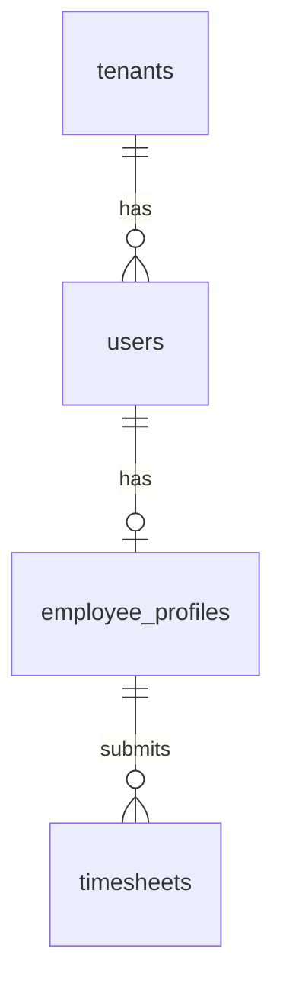

# Ask Your HR - Technical Documentation

## Getting Started

### Prerequisites
- Node.js 18+
- npm 9+
- Git
- Supabase account

### Installation

1. Clone the repository
```bash
git clone https://github.com/yourusername/ask-your-hr.git
cd ask-your-hr
```

2. Install dependencies
```bash
npm install
```

3. Set up environment variables
```bash
cp .env.example .env
```

4. Update environment variables
```env
VITE_SUPABASE_URL=your-project-url
VITE_SUPABASE_ANON_KEY=your-anon-key
VITE_SKIP_EMAIL_VERIFICATION=true  # Development only
```

5. Initialize database
```bash
npx supabase db reset
```

6. Start development server
```bash
npm run dev
```

### Environment Configuration

| Variable | Description | Required | Default |
|----------|-------------|----------|---------|
| VITE_SUPABASE_URL | Supabase project URL | Yes | - |
| VITE_SUPABASE_ANON_KEY | Supabase anonymous key | Yes | - |
| VITE_SKIP_EMAIL_VERIFICATION | Skip email verification in development | No | false |
| MODE | Application mode (development/production) | No | production |

### Development Mode

The application supports a development mode that relaxes certain security restrictions for easier testing and development:

Development mode is enabled when any of these conditions are true:
- `MODE=development` environment variable is set
- `VITE_SKIP_EMAIL_VERIFICATION=true` is set
- Running in Vite dev server (`import.meta.env.DEV`)

#### Effects of Development Mode

When development mode is active:

1. **Row Level Security (RLS)**
   - Tenant isolation is relaxed for easier testing
   - Access to IRD filing features is granted regardless of role
   - Cross-tenant data access is allowed for testing

2. **Authentication**
   - Email verification is bypassed
   - Demo accounts are automatically verified
   - Login restrictions are relaxed

3. **UI Indicators**
   - A development mode banner appears at the top of the dashboard
   - Demo account credentials are displayed
   - Additional debug information is shown

#### Managing Development Mode

To enable development mode:
```bash
# Development environment
MODE=development
VITE_SKIP_EMAIL_VERIFICATION=true

# Production environment
MODE=production
VITE_SKIP_EMAIL_VERIFICATION=false
```

#### Security Considerations

- Never enable development mode in production environments
- Development mode bypasses important security checks
- Always test with development mode disabled before deployment
- Monitor the development mode indicator to avoid accidental deployment

### Roles & Permissions Matrix

| Feature | Platform Admin | Tenant Admin | HR Manager | Payroll Admin | Employee |
|---------|---------------|--------------|------------|---------------|-----------|
| View Dashboard | ✓ | ✓ | ✓ | ✓ | ✓ |
| Manage Employees | ✓ | ✓ | ✓ | - | - |
| Process Payroll | ✓ | ✓ | - | ✓ | - |
| Approve Leave | ✓ | ✓ | ✓ | - | - |
| Submit Timesheets | - | - | - | - | ✓ |
| View Reports | ✓ | ✓ | ✓ | ✓ | - |
| IRD Filing | ✓ | ✓ | - | - | - |
| System Settings | ✓ | ✓ | - | - | - |

### Demo Accounts

The system automatically creates these accounts on first run:

1. Tenant Admin
```
Email: tenant.admin@example.com
Password: demo-password
```

2. Employee
```
Email: john.doe@example.com
Password: demo-password
```

### Example E2E Workflow

1. Employee Management
```typescript
// Create new employee
const employee = await createEmployee({
  first_name: 'Jane',
  last_name: 'Smith',
  email: 'jane.smith@example.com',
  hourly_rate: 25.00,
  tax_code: 'M',
  kiwisaver_rate: 3
});

// Submit timesheet
const timesheet = await submitTimesheet({
  employee_id: employee.id,
  entries: [{
    date: '2024-03-01',
    start_time: '09:00',
    end_time: '17:00',
    break_minutes: 30
  }]
});

// Process payroll
const payroll = await processPayroll({
  period_start: '2024-03-01',
  period_end: '2024-03-07'
});
```

## Deployment

### Production Setup

1. Environment Configuration
- Set `VITE_SKIP_EMAIL_VERIFICATION=false`
- Configure email provider in Supabase
- Set up proper security headers

2. Database Migrations
```bash
npx supabase db push
```

3. Build Application
```bash
npm run build
```

### CI/CD Pipeline

1. Pull Request Checks
- Type checking
- Linting
- Unit tests
- Integration tests

2. Deployment Steps
- Build application
- Run database migrations
- Deploy static assets
- Update environment variables

3. Post-Deployment
- Verify database connections
- Check email functionality
- Validate security policies

### Email Verification

In production:
- Email verification required
- Custom email templates
- Password reset flow
- Welcome emails

## Future Enhancements

### Planned Features

1. Employee Self-Service
- Profile management
- Document uploads
- Training records
- Performance reviews

2. Advanced Reporting
- Custom report builder
- Export to multiple formats
- Scheduled reports
- Data visualization

3. Integration Options
- Accounting software
- Time clock systems
- Document management
- HR systems

4. Mobile Features
- Native mobile app
- Timesheet submission
- Leave requests
- Push notifications

### Technical Roadmap

1. Q2 2024
- Mobile responsive design
- Advanced search functionality
- Bulk operations
- API documentation

2. Q3 2024
- Real-time notifications
- Document management
- Audit logging
- Performance optimization

3. Q4 2024
- Mobile app development
- Integration framework
- Custom workflows
- Advanced analytics

4. Q1 2025
- AI-powered insights
- Predictive analytics
- Automated compliance
- Enhanced security

A comprehensive HR management system built with React, TypeScript and Supabase, featuring employee management, timesheets, leave tracking and payroll processing. The system is designed for multi-tenant support with robust security and data isolation.

## System Architecture

### Technology Stack
- Frontend: React + TypeScript
- UI Framework: TailwindCSS
- Database: Supabase (PostgreSQL)
- Authentication: Supabase Auth
- State Management: React Context
- Icons: Lucide React

### Key Features
- Multi-tenant architecture
- Role-based access control
- Real-time updates
- Responsive design
- Comprehensive audit trails

### Security Features
- Row Level Security (RLS)
- Tenant data isolation
- Role-based permissions
- Secure authentication
- Input validation
- SQL injection prevention

## Database Structure

### Core Tables

#### tenants
- Primary table for multi-tenant support
- Stores organization information
- Used for data isolation
- Referenced by all tenant-specific tables

```sql
CREATE TABLE tenants (
  id uuid PRIMARY KEY DEFAULT uuid_generate_v4(),
  name text NOT NULL,
  created_at timestamptz DEFAULT now(),
  updated_at timestamptz DEFAULT now()
);
```

#### users
- Authentication and authorization
- Links to Supabase Auth
- Stores user roles and tenant association
- Handles email verification
- Manages user permissions

```sql
CREATE TABLE users (
  id uuid PRIMARY KEY DEFAULT uuid_generate_v4(),
  email text UNIQUE NOT NULL,
  role role_type NOT NULL,
  tenant_id uuid REFERENCES tenants(id),
  is_verified boolean DEFAULT false,
  created_at timestamptz DEFAULT now()
);
```

#### employee_profiles
- Employee information and settings
- Stores employment details
- Manages tax and KiwiSaver settings
- Tracks employment type (hourly/salary)
- Handles IRD numbers
- Links to user accounts

```sql
CREATE TABLE employee_profiles (
  id uuid PRIMARY KEY DEFAULT uuid_generate_v4(),
  user_id uuid REFERENCES users(id),
  tenant_id uuid REFERENCES tenants(id),
  first_name text NOT NULL,
  last_name text NOT NULL,
  email text NOT NULL,
  ird_number varchar(9),
  hourly_rate numeric(10,2),
  employment_type text CHECK (employment_type IN ('hourly', 'salary')),
  kiwisaver_rate numeric(4,2),
  kiwisaver_enrolled boolean,
  tax_code tax_code,
  is_active boolean DEFAULT true,
  created_at timestamptz DEFAULT now()
);
```

### Timesheet Module

The timesheet system tracks employee work hours with:
- Period-based timesheets
- Multiple daily entries
- Break time tracking
- Overtime calculations
- Approval workflow

#### timesheets
```sql
CREATE TABLE timesheets (
  id uuid PRIMARY KEY DEFAULT uuid_generate_v4(),
  employee_id uuid REFERENCES employee_profiles(id),
  tenant_id uuid REFERENCES tenants(id),
  period_start date NOT NULL,
  period_end date NOT NULL,
  status timesheet_status DEFAULT 'draft',
  submitted_at timestamptz,
  approved_at timestamptz,
  approved_by uuid REFERENCES users(id)
);
```

#### timesheet_entries
```sql
CREATE TABLE timesheet_entries (
  id uuid PRIMARY KEY DEFAULT uuid_generate_v4(),
  timesheet_id uuid REFERENCES timesheets(id),
  date date NOT NULL,
  start_time time NOT NULL,
  end_time time NOT NULL,
  break_minutes integer DEFAULT 0,
  description text,
  is_overtime boolean DEFAULT false,
  overtime_rate numeric(3,2) DEFAULT 1.5
);
```

### Leave Management

The leave management system handles:
- Multiple leave types (annual, sick, bereavement)
- Leave balance tracking
- Approval workflow
- Balance calculations
- Year-end rollovers

#### leave_requests
```sql
CREATE TABLE leave_requests (
  id uuid PRIMARY KEY DEFAULT uuid_generate_v4(),
  employee_id uuid REFERENCES employee_profiles(id),
  tenant_id uuid REFERENCES tenants(id),
  leave_type leave_type NOT NULL,
  start_date date NOT NULL,
  end_date date NOT NULL,
  status leave_status DEFAULT 'pending',
  reason text,
  submitted_at timestamptz,
  approved_at timestamptz,
  approved_by uuid REFERENCES users(id)
);
```

#### leave_balances
```sql
CREATE TABLE leave_balances (
  id uuid PRIMARY KEY DEFAULT uuid_generate_v4(),
  employee_id uuid REFERENCES employee_profiles(id),
  tenant_id uuid REFERENCES tenants(id),
  leave_type leave_type NOT NULL,
  balance_hours numeric(10,2) NOT NULL,
  accrued_hours numeric(10,2) NOT NULL,
  taken_hours numeric(10,2) NOT NULL,
  year_start date NOT NULL,
  year_end date NOT NULL
);
```

### Payroll System

The payroll system provides:
- Multiple pay period types
- Automated calculations
- Tax compliance
- KiwiSaver handling
- Detailed reporting
- Historical records

#### payroll_settings
```sql
CREATE TABLE payroll_settings (
  id uuid PRIMARY KEY DEFAULT uuid_generate_v4(),
  tenant_id uuid REFERENCES tenants(id),
  pay_period_type pay_period_type NOT NULL,
  pay_day integer NOT NULL,
  created_at timestamptz DEFAULT now()
);
```

#### payroll_runs
```sql
CREATE TABLE payroll_runs (
  id uuid PRIMARY KEY DEFAULT uuid_generate_v4(),
  tenant_id uuid REFERENCES tenants(id),
  period_start date NOT NULL,
  period_end date NOT NULL,
  processed_by uuid REFERENCES users(id),
  status payroll_status DEFAULT 'draft',
  total_gross numeric(10,2),
  total_net numeric(10,2)
);
```

#### payslips
```sql
CREATE TABLE payslips (
  id uuid PRIMARY KEY DEFAULT uuid_generate_v4(),
  payroll_run_id uuid REFERENCES payroll_runs(id),
  employee_id uuid REFERENCES employee_profiles(id),
  gross_pay numeric(10,2) NOT NULL,
  kiwisaver_deduction numeric(10,2) NOT NULL,
  employer_kiwisaver numeric(10,2) NOT NULL,
  paye_tax numeric(10,2) NOT NULL,
  net_pay numeric(10,2) NOT NULL
);
```

### Database Relationships



## Security Model

### Row Level Security (RLS)

1. Tenant Isolation
```sql
CREATE POLICY "tenant_access" ON table_name
  FOR ALL
  TO authenticated
  USING (tenant_id = get_auth_tenant_id());
```

2. Role-Based Access
```sql
CREATE POLICY "admin_access" ON table_name
  FOR ALL
  TO authenticated
  USING (
    EXISTS (
      SELECT 1 FROM users
      WHERE id = auth.uid()
      AND role IN ('platform_admin', 'tenant_admin')
    )
  );
```

### Security Functions

```sql
-- Get authenticated user's tenant ID
CREATE OR REPLACE FUNCTION get_auth_tenant_id()
RETURNS uuid AS $$
BEGIN
  RETURN (
    SELECT tenant_id
    FROM users
    WHERE id = auth.uid()
    LIMIT 1
  );
END;
$$ LANGUAGE plpgsql SECURITY DEFINER;

-- Check if user has payroll access
CREATE OR REPLACE FUNCTION has_payroll_access()
RETURNS boolean AS $$
...
```

## Payroll Processing Flow

### 1. Initialization
- Validate pay period
- Check for overlapping payroll runs
- Verify all timesheets are approved

```typescript
const validation = await validatePayrollPeriod(tenantId, startDate, endDate);
if (!validation.valid) {
  throw new Error(validation.message);
}
```

### 2. Data Collection
- Get all active employees
- Fetch approved timesheet entries
- Calculate hours worked

```typescript
const { data: entries } = await supabase
  .from('timesheet_entries')
  .select('*')
  .eq('status', 'approved')
  ...
```

### 3. Calculations
- Compute gross pay
  - For hourly employees: hours × rate
  - For salary: annual salary ÷ pay periods
- Calculate KiwiSaver
  - Employee contribution (3-10% of gross)
  - Employer contribution (fixed 3%)
- Calculate PAYE tax based on tax code
- Determine net pay

### 4. Processing
- Create payroll run record
- Generate individual payslips
- Update leave balances
- Store calculations

```typescript
// Create payroll run
const { data: payrollRun } = await supabase
  .from('payroll_runs')
  .insert({
    tenant_id: tenantId,
    period_start: startDate,
    period_end: endDate,
    ...
  });
```

### 5. Reporting
- Generate summary report
- Create individual payslips
- Calculate totals

```typescript
const totals = results.reduce((acc, { calculations }) => ({
  gross: acc.gross + calculations.grossPay,
  kiwisaver: acc.kiwisaver + calculations.kiwiSaverDeduction,
  paye: acc.paye + calculations.payeTax,
  net: acc.net + calculations.netPay
}), { gross: 0, kiwisaver: 0, paye: 0, net: 0 });
```

## Tax Calculations

### PAYE Tax Brackets (2024)
```typescript
const TAX_BRACKETS = [
  { threshold: 14000, rate: 0.105 },
  { threshold: 48000, rate: 0.175 },
  { threshold: 70000, rate: 0.30 },
  { threshold: 180000, rate: 0.33 },
  { threshold: Infinity, rate: 0.39 }
];
```

### Tax Calculation Logic
```typescript
function calculatePAYE(annualizedPay: number): number {
  let remainingPay = annualizedPay;
  let totalTax = 0;

  for (const bracket of TAX_BRACKETS) {
    const taxableInBracket = Math.min(
      Math.max(0, remainingPay - previousThreshold),
      bracket.threshold - previousThreshold
    );
    ...
```

### KiwiSaver

## Module Relationships

1. Employee → Timesheets → Entries
   - One employee has many timesheets
   - One timesheet has many entries

2. Employee → Leave Requests
   - One employee has many leave requests
   - Leave requests affect leave balances

3. Employee → Payslips ← Payroll Run
   - One payroll run generates many payslips
   - Each employee gets one payslip per run

4. Tenant → Settings
   - Each tenant has their own payroll settings
   - Settings determine pay periods and dates

## Key Features

### Payroll Module
- Multiple pay period types (weekly, fortnightly, monthly)
- Automatic tax and KiwiSaver calculations
- Support for hourly and salaried employees
- Leave balance integration
- Detailed payslips and reports
- Historical payroll data
- Validation checks
- Error handling
- Audit trails

### Timesheet System
- Multiple entries per day
- Break time tracking
- Overtime calculations
- Approval workflow
- Integration with payroll

### Leave Management
- Multiple leave types
- Balance tracking
- Approval workflow
- Integration with payroll
- Calendar view

## API Functions

### Employee Management
```typescript
async function validateEmployeeEmail(
  email: string,
  tenantId: string,
  excludeId?: string
): Promise<{
  valid: boolean;
  message?: string;
}>
```

### Payroll Processing
```typescript
async function processPayroll(
  tenantId: string,
  userId: string,
  periodStart: string,
  periodEnd: string
): Promise<{
  payrollRun: PayrollRun;
  results: PayrollResultData[];
}>
```

### Leave Management
```typescript
async function calculateLeaveHours(
  startDate: Date,
  endDate: Date
): number

async function updateLeaveBalance(
  ...
```

### Validation
```typescript
async function validatePayrollPeriod(
  tenantId: string,
  startDate: string,
  endDate: string
): Promise<{
  valid: boolean;
  message?: string;
  overlappingRuns?: PayrollRun[];
}>
```

### Timesheet Processing
```typescript
async function calculateHoursWorked(
  entry: TimesheetEntry
): number

async function validateTimesheetPeriod(
  ...
```

## Error Handling

1. Validation Errors
   - Period overlap checking
   - Timesheet approval status
   - Leave balance verification

```typescript
if (balance && requestedHours > balance.balance_hours) {
  throw new Error(`Insufficient leave balance. Available: ${balance.balance_hours}h`);
}
```

2. Processing Errors
   - Database connection issues
   - Calculation errors
   - Data consistency checks

```typescript
try {
  const isConnected = await checkSupabaseConnection();
  if (!isConnected) {
    throw new Error('Database connection failed');
  }
  ...
```

3. Security Errors
   - Authentication failures
   - Authorization checks
   - Tenant isolation violations

```typescript
if (!user?.tenant_id) {
  throw new Error('Unauthorized: Missing tenant access');
}
```

## Testing

1. Unit Tests
   - Tax calculations
   - Leave balance updates
   - Pay period validation

```typescript
describe('calculateNetPay', () => {
  it('should calculate correct PAYE tax', () => {
    const result = calculateNetPay(employee, entries);
    expect(result.payeTax).toBe(expectedTax);
  });
```

2. Integration Tests
   - Payroll processing flow
   - Database operations
   - Security policies

3. End-to-End Tests
   - Complete payroll run
   - Employee management